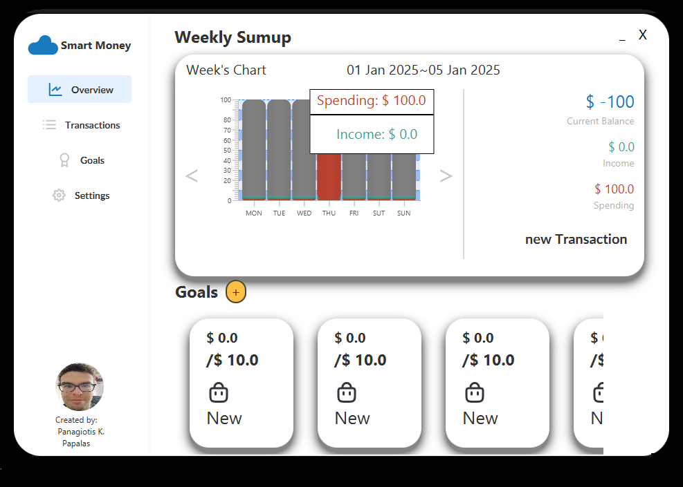

# Budget-Planer
Hello! This project is ment to be a simple finance tracking app. The project has been  programmend using JavaFX for the creation of the up and sqlite for the database.
This project is ment as a learing experience so if there is somithing i can improve, or there is some mistake in my code i would appriciate any help!

# The Application Proper ~ OverView Page

The application as is right now opens immediately on the overview page where you can see the current sumup and all the goals that you have created.

In the Overview Page you can change the chart from weeks to month and finaly to the years sumup by clicking the Title at the top. You can also change the current dates that you are viewing 
by using the buttons at the side of the chart. The chart is also able to to show the spending and income of a specific date by hovering over the bar that correspond to your disired date.

# Transactions Page

In this Page you can see all the current transactions you have catalogued in the database that corispond for current year. You can insert new, delete or update transactions.

# Goals Page

For now this is the last working pane where you can more easelly browse you goals.

# Instructions 
While i try my hand with the automatic downloading of the icons used in this project you will need to navigate to the Documents folder and insert the images and folders that are inside  the ApplicationImages folder.

# TODO 
- [ ] Fix a bug with the dates where the 31st of december will not be counted when the current date is the same year.
- [ ] Create a way to make sure there are icons on app start up.
- [ ] Insert a more robust selection of images to choose from.
- [ ] Finish the Settings Page.
